<!--
  ╔══════════════════════════════════════════════════════════════════╗
  ║  FABRÍCIO DIAS // GITHUB PROFILE // DATA ENGINEERING SYSTEM     ║
  ║  Theme: AI / JARVIS / Cyberpunk                                 ║
  ╚══════════════════════════════════════════════════════════════════╝
-->

<div align="center">


<br/>


</div>

---

## `> SYSTEM.PROFILE // SOBRE MIM`

```yaml
identity:
  name: "Fabrício Dias"
  role: "Engenheiro de Dados"
  location: "Rio de Janeiro, Brasil"
  education: "Engenharia de Dados — Instituto Infnet"

mission:
  - Construir arquiteturas de dados escaláveis
  - Automatizar processos analíticos e operacionais
  - Desenvolver pipelines ETL/ELT confiáveis
  - Transformar dados brutos em informação disponível para decisão

focus:
  data_engineering: true
  cloud: true
  rpa: true
  analytics: true
```

Sou **Engenheiro de Dados** com foco no desenvolvimento de arquiteturas escaláveis, automação de processos e construção de pipelines de dados.

Atuo principalmente com **Python, PySpark, Data Lakehouse, ETL/ELT, Cloud e RPA**, buscando reduzir tarefas manuais, aumentar a confiabilidade das rotinas e garantir que os dados estejam íntegros e disponíveis para consumo analítico.

Atualmente curso **Engenharia de Dados no Instituto Infnet** e continuo aprofundando conhecimentos em arquitetura de dados, processamento distribuído, cloud computing e automação.

---

## `> CORE.STACK // TECH STACK`

<div align="center">

### Data Engineering


<br/><br/>


<br/><br/>

### Cloud & Platforms


<br/><br/>


<br/><br/>

### Automation & RPA


<br/><br/>

### Analytics & Visualization


</div>

---

## `> TOOLKIT.LOAD // FERRAMENTAS`

<div align="center">


</div>

---

## `> PROJECTS.DIRECTORY // PROJETOS EM DESTAQUE`

<table>
<tr>

<td width="33%" valign="top">

### ⚡ Data Lakehouse

Arquiteturas em camadas **Raw → Bronze → Silver → Gold**, com foco em ingestão, transformação, qualidade e disponibilização de dados.

`Python` `PySpark` `Databricks` `Cloud`

</td>

<td width="33%" valign="top">

### 🤖 RPA Automation

Automação de rotinas operacionais e analíticas, integração com aplicações web e desktop e redução de processos manuais.

`Python` `Selenium` `Pywinauto` `PyAutoGUI`

</td>

<td width="33%" valign="top">

### 📊 Analytics Engineering

Preparação de dados e construção de soluções analíticas para transformar informação operacional em indicadores acionáveis.

`Power BI` `SQL` `Looker Studio` `QuickSight`

</td>

</tr>
</table>

---

## `> CURRENT_OBJECTIVES.exe`

```console
fabricio@data-core:~$ ./current_objectives.sh

[01] ▶ Evoluir arquiteturas modernas de Data Lakehouse
[02] ▶ Aprofundar processamento distribuído com PySpark
[03] ▶ Expandir pipelines ETL/ELT em ambientes cloud
[04] ▶ Criar automações RPA cada vez mais resilientes
[05] ▶ Aplicar observabilidade, qualidade e governança de dados
[06] ▶ Construir projetos públicos de Engenharia de Dados

SYSTEM STATUS ........................................ [ ONLINE ]
LEARNING MODE ........................................ [ ACTIVE ]
AUTOMATION ENGINE .................................... [ READY  ]
NEXT LEVEL ........................................... [ LOADING... ]
```

---

## `> GITHUB.TELEMETRY // STATS`

<div align="center">




<br/><br/>


</div>

---

## `> ACTIVITY.MONITOR // CONTRIBUTION GRAPH`

<div align="center">


</div>

---

## `> ACHIEVEMENTS.UNLOCKED // TROPHIES`

<div align="center">



</div>

---

## `> CONTRIBUTION.NEURAL_PATH // SNAKE`

<div align="center">

<picture>

  <source
    media="(prefers-color-scheme: dark)"
    srcset="https://raw.githubusercontent.com/Fobious/Fobious/output/github-contribution-grid-snake-dark.svg">

  <source
    media="(prefers-color-scheme: light)"
    srcset="https://raw.githubusercontent.com/Fobious/Fobious/output/github-contribution-grid-snake.svg">

  

</picture>

</div>

---

## `> NETWORK.INTERFACE // CONECTE-SE COMIGO`

<div align="center">

<a href="https://www.linkedin.com/in/fabr%C3%ADcio-dias-b608a7150">
  
</a>

<a href="mailto:fabricio_fabriciosantos@outlook.com.br">
  
</a>

<br/><br/>

```text
PORTUGUÊS  ████████████████████  NATIVO
ENGLISH    ███████████████░░░░░  B2
```

</div>

---

<div align="center">


<br/>

<sub>
  <code>FDS://DATA-CORE</code>
  · Engineering data.
  Automating complexity.
  Building what scales.
</sub>

<br/><br/>


</div>
